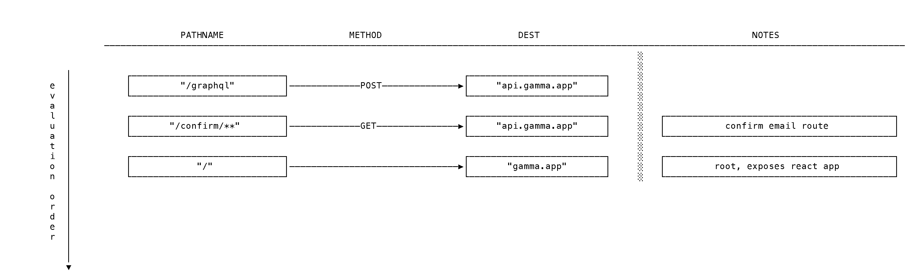

# gamma

- [gamma](#gamma)
  - [Overview](#overview)
    - [Repo Structure](#repo-structure)
  - [Conventions used in this project](#conventions-used-in-this-project)
    - [`npm` scripts](#npm-scripts)
  - [services aliases](#services-aliases)

## Overview

### Repo Structure

`gamma` is structured as a monorepo for convenience and uses `yarn workspaces` to improve developer experience.

## Conventions used in this project

### `npm` scripts

- `start:xxx` starts a **development** server for the package specified after the colon
- `build:xxx` generates a production build for the package specified after the colon

## services aliases

