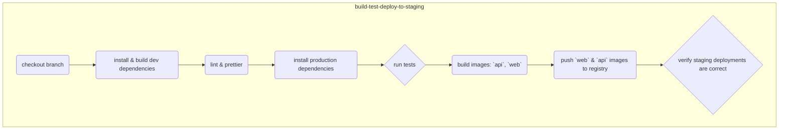
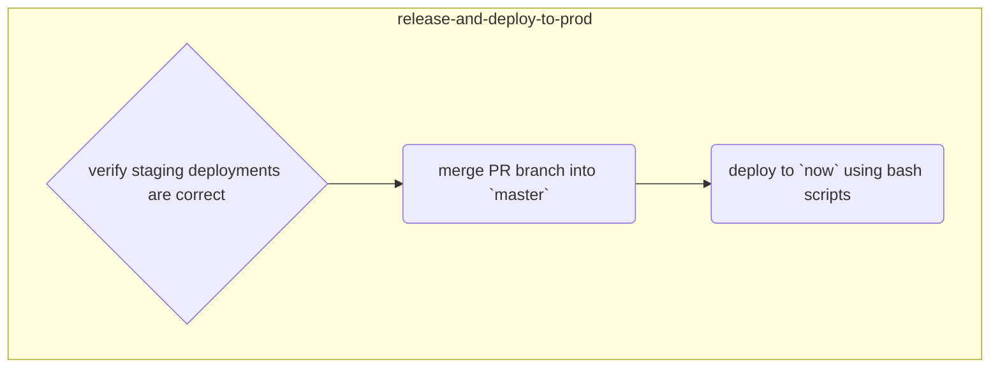

# CI & CD design

- [CI & CD design](#ci--cd-design)
    - [Overview](#overview)
        - [Staging Environment](#staging-environment)
        - [Production Environment](#production-environment)

## Overview

Please note: this document is a **WORK IN PROGRESS**.

### Staging Environment

All pushed branches/PRs will trigger the following workflow:

### Production Environment

The following workflow is triggered when pull requests are merged into `master`:

